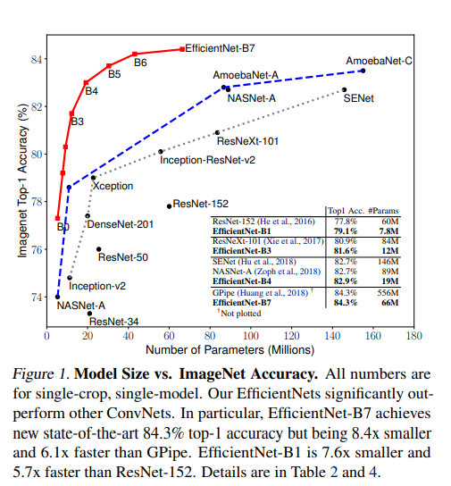

## Objective
Create a two class classifier : Field & Road using a small dataset 

## Data: 
This dataset has 153 images for training and 10 images for testing, which is relatively small. Images within the same group are quite diverse, while some from different groups could look quite the same (example: fields images contain dirt paths between crop rows) (1)

The classes are imbalanced - road samples are almost double field samples, and 2 images have wrong labels (fields instead of roads) (2)

Also, samples don’t have the same resolution and format (3)

## Method:
With a computer vision task like this my intuitive idea was using CNNs, which are easy to deal with images data, efficient and have been the cornerstone of many breakthroughs in this field. I chose to work with PyTorch framework and to solve the listed problems, I propose these methods:

(3) Image preprocessing: `torchvision` can input different formats and use `transfoms` to resize all images to 112 x 112 pixels (closest size of original images to limit  distortion). All images then being normalized using average of each channel mean and std. 

(2) Weighted Loss Function: I picked the loss function ` CrossEntropyLoss`, while it's often associated with multi-class classification, it can also be used for binary classification and it can be easily modified to assign higher weights to the minority class (field). This gives more importance to correctly classifying samples from the minority class.

(1)  Transfer learning: Leverage pre-trained models which can help the model learn relevant features even with limited samples, these models could also generalize enough to overcome imbalance and wrong labels. I chose ` EfficientNet_b0` because it is robust and has achieved state-of-the-art performance for some tasks. It also does so with a significantly lower number of parameters, making it "efficient" in terms of both computation and memory usage compared to earlier architectures, which is more suitable for embedded systems. `EfficientNet-Lite` can makes EfficientNet more suitable for mobile devices, but I go with the base `EfficientNet-B0`, which already available in pytorch. Moreover, I also trained a simple CNNs model to be baseline and tried another Resnet model to compare the accuracy. 

### Hyperparameter choosing: 

Epoch: With a small dataset, to be cautious about overfitting I start with a relatively small number of epochs (10-20) and monitor the model's performance on both the training and validation sets, stop when validation performance plateaus (around 10)

Learning rate: small (1.0e-4) to avoid converge to suboptimal solutions, for example, only guess one label (roads) 

## Results/ Conclusion:
